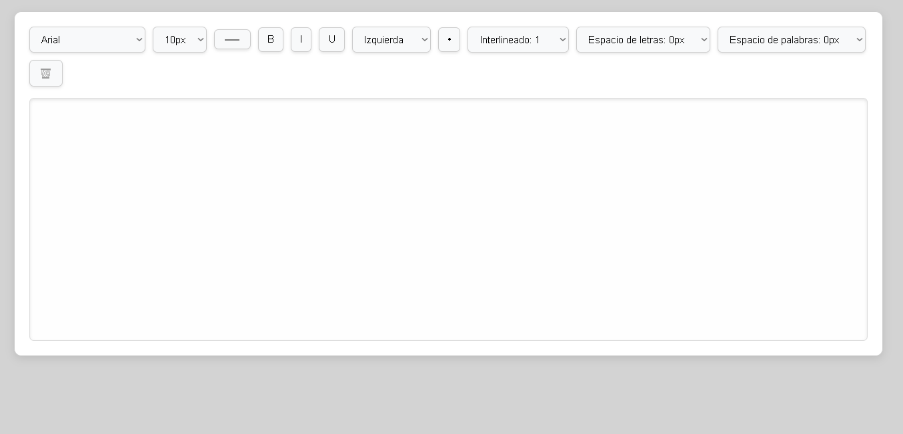

# ✍️ Editor de Texto

## 📖 Descripción
Este proyecto es un **editor de texto** diseñado para facilitar la edición de contenido directamente en la página. Incluye funcionalidades para borrar todo el contenido del editor de forma segura, evitando eliminar accidentalmente texto si el editor está vacío.

## 🌟 Características
- **Confirmación antes de borrar**: Solicita una confirmación del usuario antes de eliminar el contenido.
- **Validación de contenido vacío**: No permite borrar si el editor no contiene texto.
- **Interfaz amigable**: Utiliza la librería **SweetAlert** para proporcionar mensajes y confirmaciones interactivas.

## 📸 Capturas de pantalla


## 🛠️ Tecnologías utilizadas
<p align="center">
  <a href="https://developer.mozilla.org/es/docs/Web/JavaScript" target="_blank">
    
  </a>
  <a href="https://developer.mozilla.org/es/docs/Web/CSS" target="_blank">
    
  </a>
  <a href="https://developer.mozilla.org/es/docs/HTML/HTML5" target="_blank">
    
  </a>
</p>

- **HTML5**: Define la estructura del editor de texto.
- **CSS3**: Aplica estilos visuales al diseño.
- **JavaScript**: Añade las funcionalidades interactivas.
- **SweetAlert**: Proporciona modales elegantes para mensajes y confirmaciones.

## 🚀 Instalación y uso
### 1. Clona el repositorio en tu máquina local:
```bash
git clone https://github.com/xXRenzoElProXx/Editor_Texto.git
```
### 2. Navega a la carpeta del proyecto:
```bash
cd editor_texto
```
### 3. 3. Abre el archivo index.html en tu navegador.

## 🧑‍💻 Uso de la aplicación
* Edición de texto: Escribe directamente en el área del editor.
* Borrar contenido:
  * Haz clic en el botón "Borrar".
  * Si el editor tiene contenido, se solicitará una confirmación antes de eliminarlo.
  * Si el editor está vacío, aparecerá un mensaje indicando que no hay nada para borrar.
 
## 📂 Estructura de archivos
```bash
editor-de-texto/
├── index.html       # Archivo principal del proyecto.
├── styles.css       # Hoja de estilos para el diseño visual.
├── script.js        # Archivo con la lógica de la funcionalidad.
├── screenshot.png  # Captura de pantalla del editor.
```
